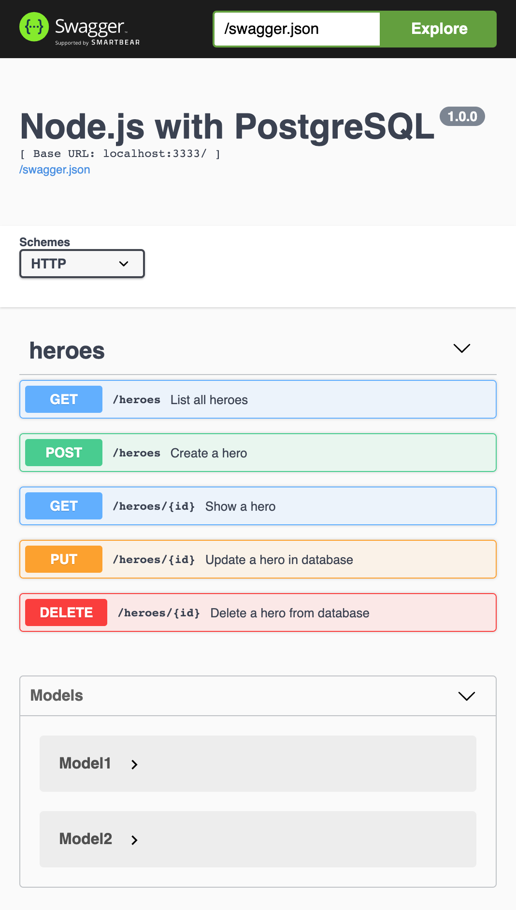

<h1 align="center">
   
  <b>Heroes: Node.js with Postgres Example</b> :superhero:
</h1>

  
  
  
  

  <a href="#rocket-technologies">Technologies</a>&nbsp;&nbsp;&nbsp;|&nbsp;&nbsp;&nbsp;
  <a href="#computer-project">Project</a>&nbsp;&nbsp;&nbsp;|&nbsp;&nbsp;&nbsp;
  <a href="#seat-getting-started">Getting started</a>&nbsp;&nbsp;&nbsp;|&nbsp;&nbsp;&nbsp;
  <a href="#thinking-how-to-contribute">How to contribute</a>&nbsp;&nbsp;&nbsp;|&nbsp;&nbsp;&nbsp;
  <a href="#memo-license">License</a>

 

  

## :rocket: Technologies

This project was developed with the following technologies:

- [Node.js](https://nodejs.org/)
- [PostgreSQL](https://www.postgresql.org/)

Extras:

- Main Libs
  - [hapi](https://hapi.dev/)
  - [Sequelize ORM](https://sequelize.org/)
  - [Swagger](https://swagger.io/)
- Deploy
  - [Docker](https://www.docker.com/)
  - [Docker Compose](https://docs.docker.com/compose/)
  - [Kubernetes](https://kubernetes.io/)

## :computer: Project

Project using Kubernetes that presents a simple API in Node.js with Postgres to insert, search, update and delete heroes.

## :seat: Getting started

These instructions will get you a copy of the full project up and running on your local machine for development and testing purposes.

### Setting up the development environment

The project is developed using Git. Git is a free and open source distributed version control system. [Download Git](https://git-scm.com/downloads).

#### Cloning the project

You can obtain the project by running the instruction bellow on your terminal:

`git clone https://github.com/diegomais/heroes.git`

### Local machine

#### Requirements

The project can be built with npm or Yarn, so choose one of the approach bellow in case you don't have any installed on your system.

- **npm** is distributed with Node.js which means that when you download Node.js, you automatically get npm installed on your computer. [Download Node.js](https://nodejs.org/en/download/).
- **Yarn** is a package manager built by Facebook Team and seems to be faster than npm in general. [Download Yarn](https://yarnpkg.com/en/docs/install).

#### Installing dependencies and running the server

Run the instructions bellow inside `heroes` directory:

1. `npm install`
2. `npm start`

or

1. `yarn install`
2. `yarn start`

### Docker Compose

#### Requirements

- **Docker** is an open-source project for automating the deployment of applications as portable, self-sufficient containers that can run on the cloud or on-premises. [Download Docker Desktop](https://www.docker.com/products/docker-desktop).
- **Docker Compose** is a tool for defining and running multi-container Docker applications. [Download Docker Compose](https://docs.docker.com/compose/install/).

#### Building containers and running the server

Run the instructions bellow inside `heroes` directory:

`docker-compose up`

### Kubernetes

#### Requirements

- **Docker** is an open-source project for automating the deployment of applications as portable, self-sufficient containers that can run on the cloud or on-premises. [Download Docker Desktop](https://www.docker.com/products/docker-desktop).
- **minikube** quickly sets up a local Kubernetes cluster on macOS, Linux, and Windows. [Install minikuke](https://minikube.sigs.k8s.io/docs/start/).

#### Start your cluster

From a terminal with administrator access (but not logged in as root), run:

`minikube start`

#### Deploy application

Run the instructions bellow inside `heroes` directory:

`kubectl apply -f k8s/.`

### Swagger

Swagger documentation available at [http://localhost:3333/documentation](http://localhost:3333/documentation).

## :thinking: How to contribute

- Fork this repository;
- Create a branch with your feature: `git checkout -b my-feature`;
- Commit your changes: `git commit -m '[feat](scope) My new feature'`;
- Push to your branch: `git push origin my-feature`.

After the merge of your pull request is done, you can delete your branch.

## :memo: License

This project is under the MIT license. See the [LICENSE](LICENSE) for more details.

---

Made with :heart: by [Diego Mais](https://diegomais.github.io/) :wave:.
