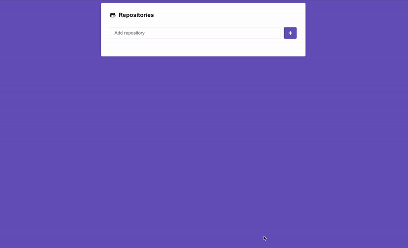

# Challenge 05. Application with ReactJS

In this challenge we will add new features in the application that we developed.

## GitHub

App to manage awesome GitHub repositories 🚀



## Features

### Catching errors

Add a `try / catch` around the code in the` handleSubmit` function present in the `Main` component and if a repository is not found in the Github API add a red border around the text input where the user typed the repository name.

### Duplicate repository

Before making the API call in the `handleSubmit` function, check the repository is not duplicated, that is, if it does not already exist in the` repositories` state.

If it exists, issue an error, and the code will fall into the `catch` of` try / catch` created in the previous feature.

```js
throw 'Repositório duplicado';
```

### Issues status filter

Add a status filter to the issues listing created in the repository detail. The status represents whether the issue is open, closed, or an option to view all.

Request examples:

```
https://api.github.com/repos/rocketseat/unform/issues?state=all
https://api.github.com/repos/rocketseat/unform/issues?state=open
https://api.github.com/repos/rocketseat/unform/issues?state=closed
```

Further details at documentation in [this link](https://developer.github.com/v3/issues/#parameters-1);

### Pagination

Add pagination on the issues listed in the repository detail. The Github API lists a maximum of 30 issues per page and we can control the current page number by a parameter in the request address:

```
https://api.github.com/repos/rocketseat/unform/issues?page=2
```

Add only a button to next page and previous page. The previous page button should be off on the first page.

## Submit

This challenge **does not need to be delivered** and will not receive correction, but you can see the result of the challenge code here: https://github.com/Rocketseat/bootcamp-gostack-desafio-05

"For those who get better every day, getting ready is utopia!"

## Getting Started

These instructions will get you a copy of the project up and running on your local machine for development and testing purposes.

### Prerequisites

The project can be built with npm or yarn, so choose one of the approach bellow in case you don't have any installed on your system.

* **Npm** is distributed with Node.js which means that when you download Node.js, you automatically get npm installed on your computer. [Download Node.js](https://nodejs.org/en/download/)

* **Yarn** is a package manager built by Facebook Team and seems to be faster than npm in general.  [Download Yarn](https://yarnpkg.com/en/docs/install)

### Installing

To download the project follow the instructions bellow:

```
1. git clone https://github.com/diegomais/rocketseat-bootcamp-gostack-challenge-05-github-reactjs.git
2. cd rocketseat-bootcamp-gostack-challenge-05-github-reactjs
```

Then install dependencies and run:

```
3. yarn install
4. yarn dev
```

or

```
3. npm install
4. npm dev
```

## License

This project is licensed under the MIT License - see the [LICENSE](LICENSE) file for details
